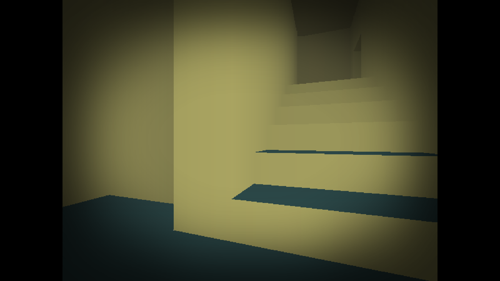
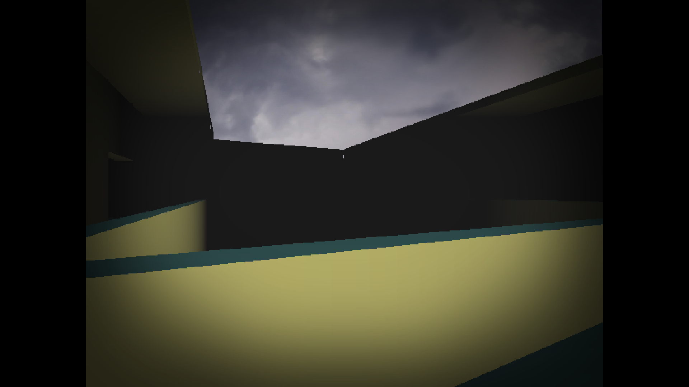
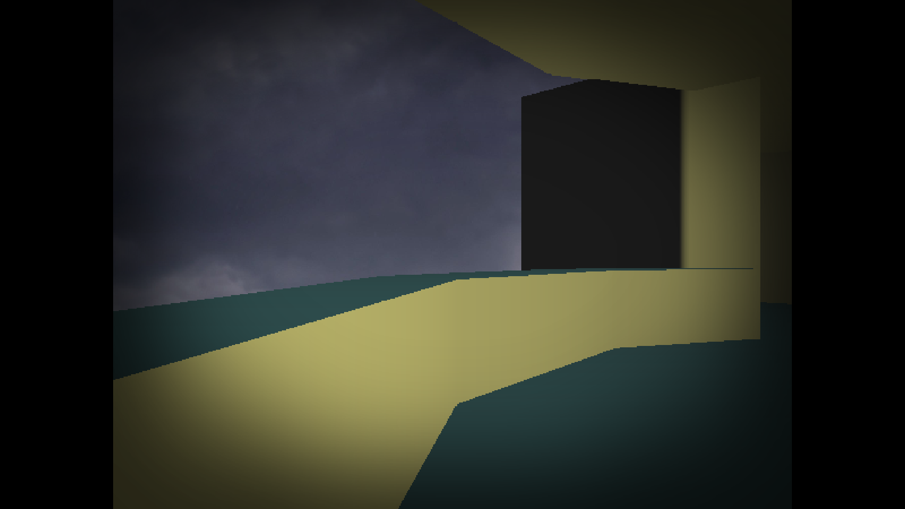
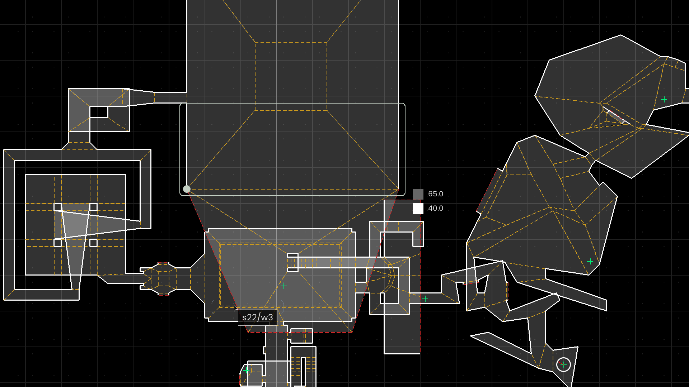

# Introduction

&nbsp;&nbsp;&nbsp;&nbsp; **“watch”** is a horror game that involves the player, trapped in a *non-euclidean* maze which overlaps on itself, trying to escape and avoid horrors unknown.
It also features liminal constructs resembling malls or metropolitan areas to give the player a dreamlike, nostalga sensation.

&nbsp;&nbsp;&nbsp;&nbsp; The game has a built-in map editor, so anyone could create their own or modify existing levels.
The keybinds are explained [below](#keybinds-1).

# Quick Start

Dependencies were managed using `uv`. To run the game, .

```sh
git clone https://github.com/SWH03403/COS10009-project_watch watch_game
cd watch_game
uv run python .
# or
WATCH_EDITOR=1 uv run python . # to open in editor mode by default
```

Level name can be specified in the CLI, the list of all existing levels can be found [here](/assets/levels).

```sh
uv run python . test/cafe
```

# Gameplay

## Screenshots

|  |  |
| -- | -- |
|  |  |

## Keybinds

&nbsp;&nbsp;&nbsp;&nbsp; Use WASD and mouse for basic movements.

* **Q** or **Esc**: Quit the application
* **[**: Toggle the Map Editor
* **P**: Enable "Slow Render" for 1 Frame
* **L-Shift**: Sprint
* **\\**: Toggle God Mode

# Map editor



## Keybinds

***DISCLAMER**:* *These are currently experimental and expected to be changed.*

* **Q** or **Esc**: Quit the application or Return to Normal Mode
* **[**: Toggle the Map Editor
* **Del**: Delete the selected item

To pan around, simply click and drag on empty regions.
Hold **Space** for panning-only mode, selection remains unchanged.
Use the Scrollwheel to zoom in and out.

Click any element on the map and click it again before dragging to move it.
The second click is needed to avoid snapping the selection to the grid.

Selection dependent actions: **.** for unselected, **V** for vertexes, **W** for walls, **S** for sectors, **@** for spawnpoints.

* **A** (.W): Insert a vertex. If a wall is selected, the new vertex will be its midpoint.
* **B** (S): Place a spawn in the selected sector
* **C** (V): Create a new sector
* **D** (V): Divide a sector by connecting its vertexes
* **E** (W): Choose the same wall belonging to a neighbor sector
* **P** (S@): Move the player to the selected sector or spawn
* **R** (S): Reverse vertexes order of a sector

Change properties of the selected wall, hold **Shift** to make on-sided change if wall is shared by multiple sectors.

* **1**: Make the selected wall solid
* **2**: Make the selected wall passable if there is a neighbor sector.
* **3**: Make the skybox visible through the selected wall.

### Snapping

Holding modifier keys will adjust the grid size, default is 5 units.

* **Alt**: Disable snapping
* **Ctrl**: 20 units
* **Shift**: 1 unit

### Sector properties

&nbsp;&nbsp;&nbsp;&nbsp; Current, only the visibility and height of the selected sector is modifiable with the editor.

* Use **LMB** to toggle visibility.
* Use the scrollwheel to adjust height. Default step is 1 unit, which can be adjusted with modifier keys:
  - **Alt**: 0.1 unit
  - **Ctrl**: 20 units
  - **Shift**: 5 units
