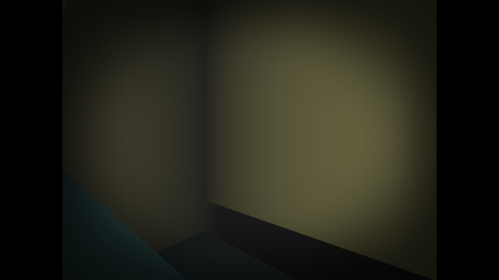

# Introduction

   “watch” is a game that involves the player, trapped in a non-euclidean maze which overlaps on itself, trying to escape and avoid horrors unknown.
It also features liminal constructs resembling malls or metropolitan areas to give the player a dreamlike, nostalga sensation.

   In addition, there is a map editor in the game itself, which could be used by anyone to create their own mazes or to modify existing levels.
The keybindings are explained below.

# Gameplay

## Screenshots

*"cliff"*

# Map editor
